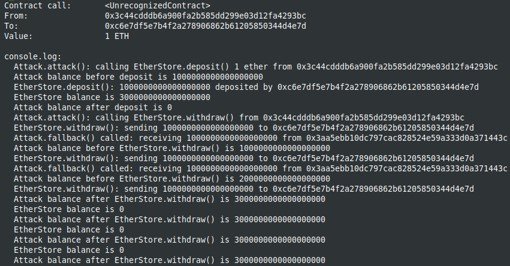
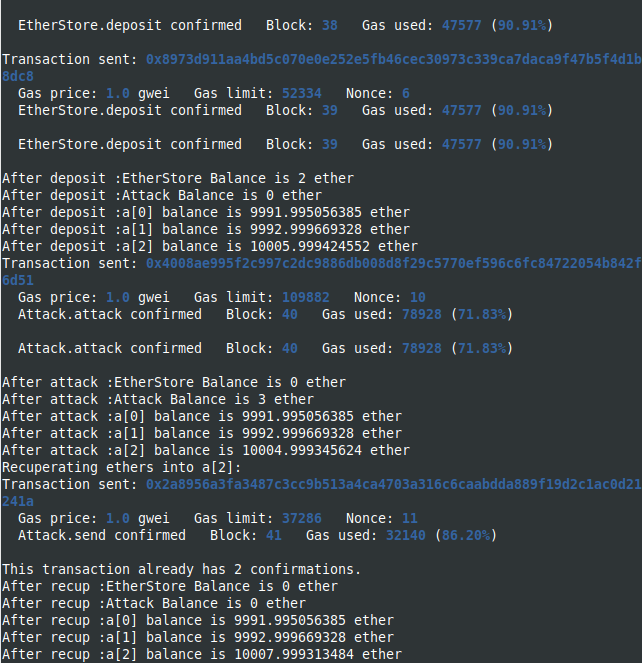

# Reentrancy Attack with brownie and hardhat

This project demonstrates the reentrancy attack using brownie and hardhat network
The contract used is ReentrancyAttack from [Solidy by Example site], (https://solidity-by-example.org/hacks/re-entrancy/)
The ReentrancyAttack.sol contract is commented with console.log, showing different values during the execution of different functions in the contracts.

Clone the repository

```
git clone https://.....
```

Install hardhat dependencies (npm install) and start the hardhat network:

```
npm install
npx hardhat node
```

Before executing deployments, make sure to export to .env the private key of the first account from the hardhat network

example in .env:

```
export PRIVATE_KEY=0xaaaaaaaaaaaaaaaaaaa
```

Then run

```
source .env
brownie run scripts/deploy.py
```

Watch the hardhat network console during the execution of calls in the brownie deploy.py
It shows different values for contracts and accounts during calls.





The contract ReentrancyGuard shows the declaration of the noReentrant modifier, to use in the function withdraw() in order to protect it from reentrancy attacks.
